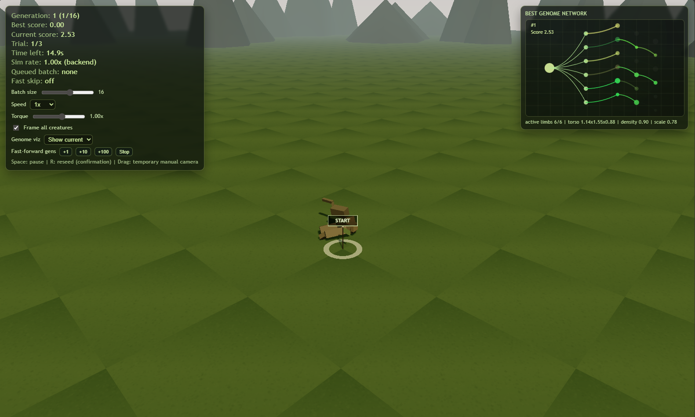

# Breve Creatures Clone



Browser-based evolutionary creature simulation.

## Repo Layout

- `frontend/` - UI + local FastAPI static server
- `backend/` - Rust simulation and evaluation service
- `tools/` - local helper tooling

## Quick Start

Prereqs:

- Python 3.12+
- [Astral `uv`](https://docs.astral.sh/uv/)
- Rust toolchain (`rustup`, `cargo`)

1. Start backend

```powershell
cd backend
cargo run
```

2. Start frontend

```powershell
cd frontend
uv sync
uv run main.py
```

3. Open app

- `http://127.0.0.1:8000`

## Docs

- Frontend details: `frontend/README.md`
- Backend details: `backend/README.md`
